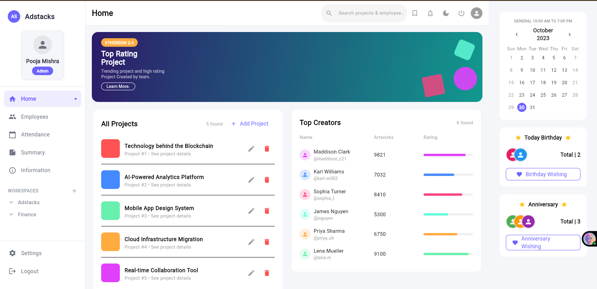
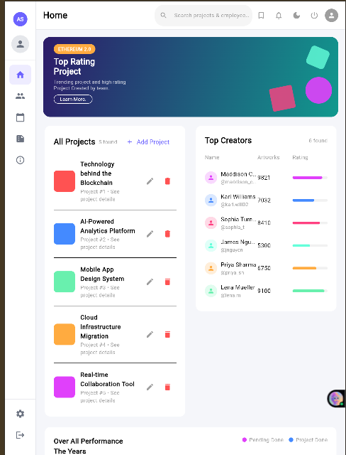
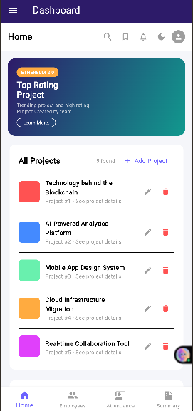

# Adstacks Office Dashboard

A fully responsive Flutter Web dashboard built as part of the 
Adstacks Media Flutter Developer internship assignment.

## 🔗 Live Demo
**[adstacks-dashboard.vercel.app](https://adstacks-dashboard-kohl.vercel.app/)**

---

## 📸 Screenshots

### Desktop


### Tablet


### Mobile


---

## ✨ Features

- ✅ Fully responsive — mobile, tablet, and desktop layouts
- ✅ Live search — filters projects and employees as you type
- ✅ Add / Edit / Delete projects with form validation
- ✅ Interactive line chart with hover and tap tooltips
- ✅ Dark mode toggle with smooth animated transition
- ✅ Collapsible sidebar (icon-only on tablet)
- ✅ Birthday and Anniversary panel with wishing actions
- ✅ Calendar widget highlighting today's date
- ✅ Clean architecture — separated data, providers, widgets, screens

---

## 🛠️ Tech Stack

| Technology | Purpose |
|---|---|
| Flutter 3.x | Cross-platform UI framework |
| fl_chart | Interactive performance line chart |
| table_calendar | Calendar widget |
| provider | State management |
| go_router | Navigation/routing |
| Google Fonts | Typography |

---

## 📁 Project Structure
lib/

├── main.dart

├── core/

│   └── theme/

│       └── app_theme.dart        # Light & dark theme definitions

├── models/

│   ├── project_model.dart

│   └── employee_model.dart

├── data/

│   └── dummy_data.dart           # Sample projects & employees

├── providers/

│   ├── theme_provider.dart       # Dark mode toggle

│   ├── search_provider.dart      # Live search filtering

│   └── project_provider.dart     # Add/Edit/Delete projects

├── widgets/

│   ├── sidebar.dart

│   ├── top_navbar.dart

│   ├── hero_banner.dart

│   ├── all_projects_card.dart

│   ├── top_creators_table.dart

│   ├── performance_chart.dart

│   ├── calendar_widget.dart

│   ├── birthday_anniversary_card.dart

│   └── project_form_sheet.dart

└── screens/

└── dashboard_screen.dart

---

## 🚀 Run Locally

**Prerequisites:** Flutter SDK 3.x, Chrome browser

```bash
# Clone the repo
git clone https://github.com/sakshiv3107/adstacks-dashboard.git
cd adstacks-dashboard

# Install dependencies
flutter pub get

# Run on Chrome
flutter run -d chrome

# Build for production
flutter build web --release
```

---

## 📐 Responsive Breakpoints

| Breakpoint | Layout |
|---|---|
| < 768px (Mobile) | Drawer sidebar + bottom scroll for right panel |
| 768px–1100px (Tablet) | Icon-only sidebar (width 70) + main content |
| > 1100px (Desktop) | Full 3-panel layout |

---

## 🎯 Assignment Requirements

| Requirement | Status |
|---|---|
| Responsive (mobile, tablet, web) | ✅ Done |
| Matches provided design | ✅ Done |
| Hosted on Vercel | ✅ Done |
| Office dashboard use case | ✅ Done |

---

## 👩‍💻 Built By

**Sakshi** — Flutter & Mobile Developer  
🌐 [sakshix.tech](https://sakshix.tech) · 
🐙 [github.com/sakshiv3107](https://github.com/sakshiv3107)
